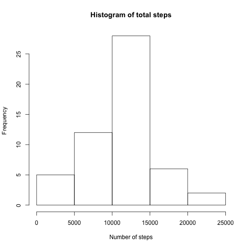
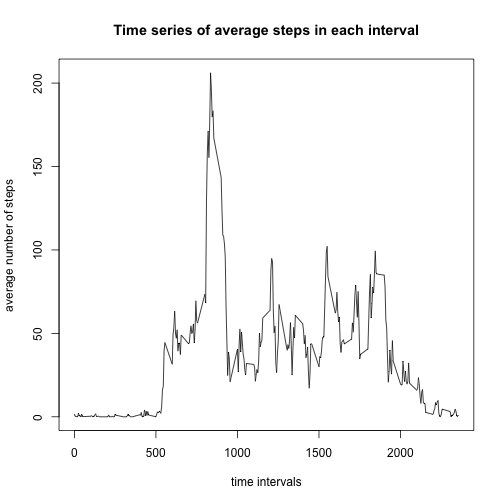
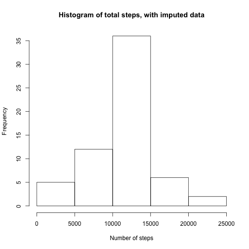
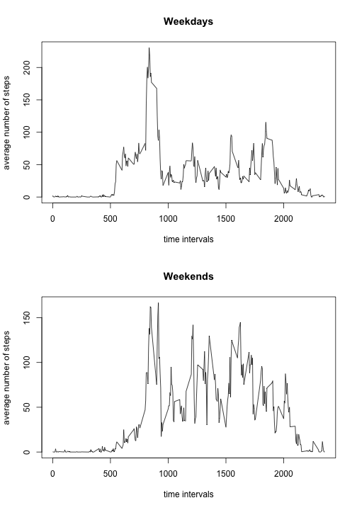

Reproducible Research: Assignment 1
===================================

It is now possible to collect a large amount of data about personal movement using activity monitoring devices such as a Fitbit, Nike Fuelband, or Jawbone Up. These type of devices are part of the “quantified self” movement – a group of enthusiasts who take measurements about themselves regularly to improve their health, to find patterns in their behavior, or because they are tech geeks. But these data remain under-utilized both because the raw data are hard to obtain and there is a lack of statistical methods and software for processing and interpreting the data.

This assignment makes use of data from a personal activity monitoring device. This device collects data at 5 minute intervals through out the day. The data consists of two months of data from an anonymous individual collected during the months of October and November, 2012 and include the number of steps taken in 5 minute intervals each day.

## Loading and pre-processing the data

First, we'll read in the data using read.csv.


```r
data <- read.csv("activity.csv")
```

## What is the mean number of steps taken per day?

We'll use the aggregate function to sum the totals for each day, and rename the columns.


```r
total <- aggregate(data$steps, list(data$date), sum)
names(total) <- c("Date", "TotalSteps")
hist(total$TotalSteps, main = "Histogram of total steps", xlab="Number of steps")
```



We can also calculate the mean and median of the number of steps each day.


```r
datamean <- mean(total$TotalSteps, na.rm = TRUE)
datamedian <- median(total$TotalSteps, na.rm = TRUE)
```

Using this, we calculate that the mean daily number of steps is 1.0766189 &times; 10<sup>4</sup> and the median is 10765.

## What is the average daily activity pattern?

We can work out the average number of steps for each five-minute interval, and plot that as a time series.


```r
intavg <- aggregate(data$steps, list(data$interval), mean, na.rm = TRUE)
names(intavg) <- c("interval", "averageSteps")

plot(x=intavg$interval, y=intavg$averageSteps, type = "l", xlab = "time intervals", ylab = "average number of steps", main = "Time series of average steps in each interval")
```



```r
max <- intavg$interval[which.max(intavg$averageSteps)]
```

The interval in which the average number of steps was highest is 835.

## Imputing missing values


```r
naTot <- sum(is.na(data$steps))
```

There are 2304 missing values for the number of steps in the data.

For this analysis, we will replace NAs with the corresponding average for that 5-minute interval.


```r
avgs <- rep(intavg$averageSteps, times= 61)
newdata <- data
for (i in 1:17568) {
      if (is.na(newdata$steps[i]) == TRUE ) {
            newdata$steps[i] <- avgs[i]
      }
}
```

We can use the new dataset, with NA values replaced by imputed data, to plot a histogram.


```r
newtotal <- aggregate(newdata$steps, list(newdata$date), sum)
names(newtotal) <- c("Date", "TotalSteps")

hist(newtotal$TotalSteps, main = "Histogram of total steps, with imputed data", xlab="Number of steps")
```



```r
newmean <- mean(newtotal$TotalSteps, na.rm = TRUE)
newmedian <- median(newtotal$TotalSteps, na.rm = TRUE)
```

With the imputed data, we calculate that the mean daily number of steps is 1.0766189 &times; 10<sup>4</sup> and the median is 1.0766189 &times; 10<sup>4</sup>.

With rounding errors, the mean and median without the imputed data (which were 1.0766189 &times; 10<sup>4</sup> and 10765 respectively) are very close to the imputed data. Imputing data has not changed the mean and median values substantially.

## Are there differences in activity patterns between weekdays and weekends?

We can analyse the differences between activity during the week and at weekends.


```r
require(lubridate)
newdata$chardate <- sapply(newdata$date, as.character)
## add a column for day of the week
newdata$days <- sapply(newdata$chardate, wday, label = TRUE)
## add a column for weekday or weekend
require(dplyr)
newdata <- mutate(newdata, daytype = factor(1 * days %in% c("Sun", "Sat"), labels = c("weekday", "weekend")))
```

We can use this data to average the number of steps for weekday and weekend activity separately.


```r
weekdaydata <- filter(newdata, daytype == "weekday")
weekenddata <- filter(newdata, daytype == "weekend")

## weekday averages
wdavg <- aggregate(weekdaydata$steps, list(weekdaydata$interval), mean)
names(wdavg) <- c("interval", "averageWDsteps")

## weekend averages
weavg <- aggregate(weekenddata$steps, list(weekenddata$interval), mean)
names(weavg) <- c("interval", "averageWEsteps")

## bind the two together
splitdata <- cbind(wdavg, weavg$averageWEsteps)
names(splitdata) <- c("interval", "weekdaySteps", "weekendSteps")
```

Now we've averaged the data for weekdays and weekends separately, we can plot time series for each of them.


```r
par(mfrow = c(2,1))
plot(x=splitdata$interval, y=splitdata$weekdaySteps, type = "l", xlab = "time intervals", ylab = "average number of steps", main = "Weekdays")
plot(x=splitdata$interval, y=splitdata$weekendSteps, type = "l", xlab = "time intervals", ylab = "average number of steps", main = "Weekends")
```


